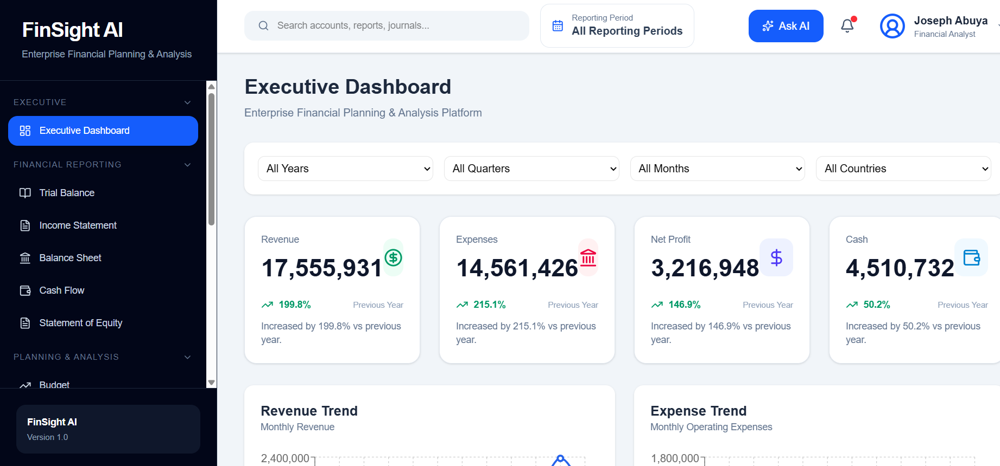
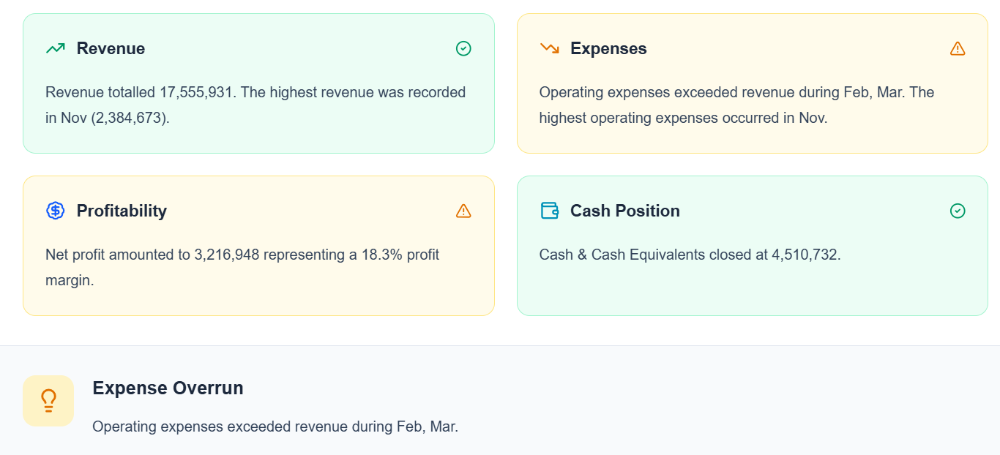
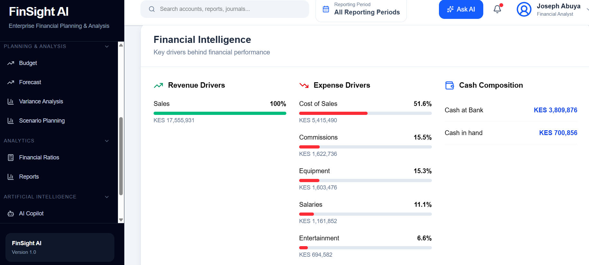
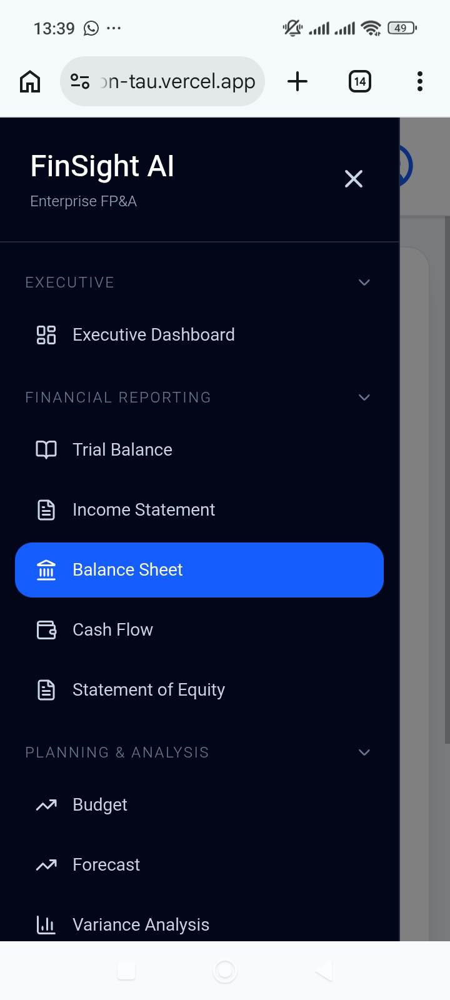

# FinSight AI

### AI-Powered Financial Planning & Analysis (FP&A) Platform

> Enterprise Financial Planning & Analysis platform for reporting, budgeting, forecasting, KPI monitoring, and AI-driven executive decision support.


---

# 🚀 Live Demo

### 🌐 Frontend

https://finsight-ai-ebon-tau.vercel.app

### ⚙ Backend API

https://finsight-ai-xtss.onrender.com

### 💻 GitHub Repository

https://github.com/AbuyaAbuya/finsight-ai

---

# 📖 Overview

FinSight AI is an enterprise-grade **Financial Planning & Analysis (FP&A)** platform designed to transform traditional financial reporting into an intelligent decision-support system.

The application combines financial reporting, budgeting, forecasting, variance analysis, KPI monitoring, financial intelligence, and AI-generated insights within one modern web platform.

Rather than simply displaying financial statements, FinSight AI enables finance professionals to:

- Monitor organizational performance
- Understand profitability drivers
- Analyze revenue and expense trends
- Track cash flow and liquidity
- Support executive decision-making
- Generate AI-powered financial insights

The long-term vision is to evolve FinSight AI into a comprehensive **Enterprise Performance Management (EPM)** platform capable of supporting CFOs, FP&A teams, Finance Managers, Controllers, and Executive Leadership.

---

# 📸 Application Preview

## Executive Dashboard

A centralized executive dashboard providing real-time visibility into key financial metrics including Revenue, Expenses, Net Profit, Cash Position, KPI monitoring, and interactive financial trends.



---

## Executive Insights

AI-powered financial summaries that automatically highlight key revenue trends, profitability performance, operating expenses, and cash position to support executive decision-making.



---

## Financial Intelligence

Interactive financial analytics showing revenue drivers, expense composition, and cash allocation to help identify the factors driving business performance.



---

## Mobile Experience

Responsive mobile interface enabling finance professionals to securely access dashboards, financial reports, and analytics from any device.



---
# ✨ Current Features

FinSight AI is being developed as an enterprise-grade Financial Planning & Analysis (FP&A) platform that combines financial reporting, analytics, planning, and artificial intelligence into a unified decision-support system.

## 📊 Executive Dashboard

The Executive Dashboard provides a comprehensive financial overview through interactive visualizations and executive-level KPIs.

### Current capabilities

- Revenue Monitoring
- Expense Monitoring
- Net Profit Analysis
- Cash Position Tracking
- Interactive KPI Cards
- Monthly Revenue Trends
- Expense Trend Analysis
- Profitability Analysis
- AI-powered Executive Insights
- Financial Recommendations

---

## 📑 Financial Reporting

Generate standardized financial reports from a centralized financial data warehouse.

### Available Reports

- Trial Balance
- Income Statement
- Balance Sheet
- Cash Flow Statement
- Statement of Changes in Equity

---

## 📈 Planning & Analysis

Core FP&A capabilities currently under development.

### Current Modules

- Budget Planning
- Financial Forecasting
- Variance Analysis
- Scenario Planning

---

## 📉 Financial Analytics

Interactive analytics designed to help finance teams better understand organizational performance.

### Available Analytics

- Financial Ratios
- Revenue Analysis
- Expense Analysis
- Profitability Analysis
- Revenue Drivers
- Expense Drivers
- Cash Composition Analysis
- Executive KPI Reporting

---

## 🤖 Artificial Intelligence

The AI layer is designed to transform traditional reporting into intelligent financial decision support.

### Current Features

- Executive Insights
- Automated Financial Commentary
- Financial Recommendations

### Planned Features

- AI Financial Copilot
- Natural Language Financial Queries
- Predictive Forecasting
- Cash Flow Prediction
- Automated Variance Explanations
- Board Report Generation
- Financial Risk Detection

---

# ⭐ Key Highlights

- Enterprise-grade FP&A Platform
- Executive Financial Dashboard
- Financial Intelligence Engine
- Interactive KPI Reporting
- AI-powered Executive Insights
- Financial Statement Reporting
- Revenue & Expense Analytics
- Responsive Web Interface
- REST API Architecture
- Cloud Deployment
- Mobile-Friendly Design
- Modern React User Experience

---

# 🛠 Technology Stack

| Layer | Technology |
|--------|------------|
| **Frontend** | React, Vite, Tailwind CSS, React Router, Axios |
| **Backend** | Python, FastAPI |
| **Database** | DuckDB |
| **Data Processing** | Pandas, OpenPyXL |
| **Charts & Visualizations** | Recharts |
| **Icons** | Lucide React |
| **Deployment** | Vercel, Render |
| **Version Control** | Git & GitHub |

---

# 🏗 System Architecture

```text
              Excel / ERP / Accounting Data
                           │
                           ▼
                Data Processing (Pandas)
                           │
                           ▼
                   DuckDB Data Warehouse
                           │
                           ▼
                    FastAPI REST API
                           │
                           ▼
               React + Tailwind Frontend
                           │
                           ▼
              Executive Financial Dashboard
                           │
                           ▼
             AI Insights & Recommendation Engine
```

---
# 🚧 Project Status

**Current Version:** v1.0

**Development Status:** Active Development

FinSight AI is currently under active development with a focus on building an enterprise-grade AI-powered Financial Planning & Analysis (FP&A) platform. While the current version delivers interactive dashboards, financial reporting, and executive insights, several advanced planning and AI capabilities are under development.

---

# ✅ Current Dashboard Modules

The following modules are currently available or under active development.

| Module | Status |
|---------|:------:|
| Executive Dashboard | ✅ |
| Trial Balance | ✅ |
| Income Statement | ✅ |
| Balance Sheet | ✅ |
| Cash Flow Statement | ✅ |
| Statement of Changes in Equity | ✅ |
| Budget | 🚧 |
| Forecast | 🚧 |
| Variance Analysis | 🚧 |
| Scenario Planning | 🚧 |
| Financial Ratios | 🚧 |
| Reports | 🚧 |
| AI Copilot | 🚧 |

---

# 🗺 Roadmap

## ✅ Phase 1 — Foundation (Completed)

- Financial Data Warehouse
- FastAPI REST API
- React Frontend
- Executive Dashboard
- KPI Reporting
- Financial Statements
- Revenue Analysis
- Expense Analysis
- Cash Analysis
- Executive Financial Insights
- Cloud Deployment (Vercel + Render)

---

## 🚧 Phase 2 — Planning & Analysis (In Progress)

- Budget Planning
- Rolling Forecasts
- Variance Analysis
- Scenario Planning
- Financial Ratio Analysis
- Executive Reports
- PDF Export
- Excel Export
- PowerPoint Export

---

## 🔐 Phase 3 — Enterprise Features

- User Authentication
- Role-Based Access Control
- Multi-Company Support
- Consolidated Reporting
- Audit Logs
- Scheduled Reports
- Notification Center

---

## 🤖 Phase 4 — Artificial Intelligence

- AI Financial Copilot
- Natural Language Financial Queries
- Predictive Forecasting
- Cash Flow Prediction
- Financial Risk Detection
- Automated Variance Explanations
- Intelligent Board Reports
- Conversational Financial Analytics

---

## 🌍 Phase 5 — Enterprise Integrations

- SAP
- Oracle ERP
- Microsoft Dynamics
- QuickBooks
- Xero
- Odoo
- REST API Integrations
- Cloud Data Warehouses

---

# 🎯 Future Vision

The long-term vision is to transform FinSight AI into an Enterprise Performance Management (EPM) platform that combines Financial Planning & Analysis, Business Intelligence, Artificial Intelligence, and Predictive Analytics into a unified decision-support solution.

The platform is being designed to support:

- Chief Financial Officers (CFOs)
- FP&A Analysts
- Finance Managers
- Controllers
- Executive Leadership Teams
- Business Decision Makers

Future releases will introduce intelligent budgeting, predictive forecasting, scenario modelling, AI-assisted financial analysis, conversational reporting, and enterprise ERP integrations, enabling organizations to move beyond traditional reporting towards proactive financial decision-making.

---
# ☁ Deployment

The application is currently deployed using the following services:

| Component | Platform |
|------------|----------|
| Frontend | Vercel |
| Backend API | Render |
| Database | DuckDB |

---

# 📂 Project Structure

```text
finsight-ai/
│
├── backend/
│   ├── analytics/
│   ├── api/
│   ├── services/
│   ├── database/
│   └── main.py
│
├── frontend/
│   ├── components/
│   ├── contexts/
│   ├── layouts/
│   ├── pages/
│   └── services/
│
├── database/
│
├── data/
│
├── screenshots/
│
├── docs/
│
├── requirements.txt
│
└── README.md
```

---

# 🤝 Contributing

Contributions, ideas, and constructive feedback are welcome.

If you would like to improve FinSight AI:

1. Fork the repository
2. Create a feature branch
3. Commit your changes
4. Open a Pull Request

---

# 👨‍💻 Author

## Joseph Abuya

Finance • Financial Planning & Analysis (FP&A) • Data Science • Business Intelligence • Artificial Intelligence

### GitHub

https://github.com/AbuyaAbuya

### LinkedIn

https://www.linkedin.com/in/joseph-abuya/

---

# 🙏 Acknowledgements

FinSight AI is a personal initiative that brings together Financial Planning & Analysis (FP&A), Business Intelligence, Data Engineering, and Artificial Intelligence into a unified enterprise finance platform.

The project serves as both a learning journey and a demonstration of how modern analytics and AI can enhance financial planning, reporting, and strategic decision-making.

Special thanks to the open-source community whose tools and libraries have made this project possible.

---

# ⭐ Support the Project

If you found this project interesting or useful:

⭐ Star the repository

🍴 Fork the repository

💬 Share your feedback

Your support and suggestions are greatly appreciated as FinSight AI continues to evolve.